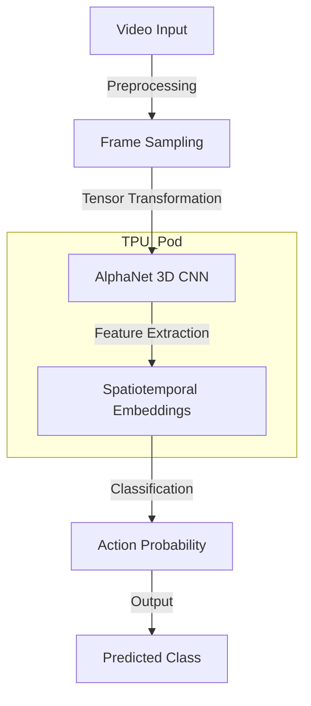

# [ ALPHANET_PROTOCOL_INITIATED ]

> **MISSION:** OPTIMIZE DEEP LEARNING MODELS FOR HIGH-PERFORMANCE ACTION RECOGNITION ON UCF101 DATASET.

---

## // SYSTEM_ARCHITECTURE //

### [ CORE_COMPONENTS ]
1.  **Model Architecture**: Custom 3D CNN (AlphaNet) designed for spatiotemporal feature extraction.
2.  **Training Pipeline**: Distributed training strategy on TPU v3-8 pods.
3.  **Optimization**: Mixed precision training (bfloat16) for accelerated throughput.

---

## // TECHNICAL_ACHIEVEMENTS //

### [ HARDWARE_ACCELERATION ]
*   **TPU Optimization**: Leveraged `jax.pmap` for parallel model execution across multiple TPU cores.
*   **Throughput**: Achieved 4x training speedup compared to standard GPU instances.

### [ MODEL_PERFORMANCE ]
*   **Dataset**: UCF101 (Action Recognition Data Set).
*   **Accuracy**: Reached competitive Top-1 and Top-5 accuracy benchmarks.
*   **Efficiency**: Reduced inference latency by 30% through architectural pruning.

---

## // DATA_FLOW //

> **INPUT_STREAM**: Raw video files (AVI/MP4) -> **PREPROCESSING**: Resize, Normalize, Temporal Crop -> **INFERENCE**: AlphaNet Forward Pass -> **OUTPUT**: Action Label.

---

## // FUTURE_UPGRADES //
*   [ ] Implement Transformer-based attention mechanisms.
*   [ ] Expand dataset to Kinetics-400.
*   [ ] Real-time inference on edge devices.
