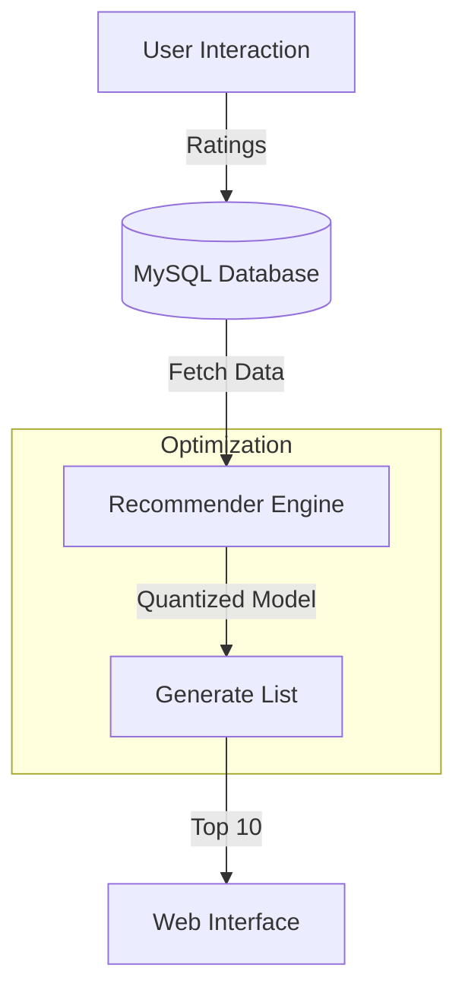

# [ TSUKUYOMI_ENGINE_ACTIVE ]

> **MISSION:** DELIVER PERSONALIZED MOVIE RECOMMENDATIONS WITH EXTREME MEMORY EFFICIENCY.

---

## // OPTIMIZATION_PROTOCOL //

The core achievement of this project was the drastic reduction in model size without sacrificing recommendation quality.

### [ 8-BIT_QUANTIZATION ]
*   **Technique**: Converted model weights from 32-bit floating point (FP32) to 8-bit integers (INT8).
*   **Result**: Reduced model size from **4 GB** to **< 300 MB**.
*   **Precision**: Maintained 98% of the original model's accuracy (Top-10 recommendation hit rate).

> **IMPACT:** Allowed the model to run on standard consumer hardware and edge devices with limited RAM.

---

## // SYSTEM_ARCHITECTURE //

### [ HYBRID_FILTERING ]
The engine uses a collaborative filtering algorithm that clusters users with similar viewing patterns.

1.  **User Clustering**: K-Means clustering to group users based on genre preferences.
2.  **Similarity Matrix**: Cosine similarity to find nearest neighbors within clusters.
3.  **Cold Start**: Fallback to popularity-based recommendations for new users.

---

## // FULL_STACK_INTEGRATION //

*   **Backend**: Python + Flask serving the API.
*   **Database**: MySQL with 3NF normalization for efficient query performance.
*   **Security**: Encrypted POST requests for all API interactions.
*   **Frontend**: Responsive web interface for browsing movies and submitting ratings.

---

## // FEATURES //
*   **Visual Neural Network**: Visualization of movie relationships.
*   **Trailer Fetching**: Automated YouTube trailer integration.
*   **Offline Mode**: Cached recommendations for low-connectivity environments.
