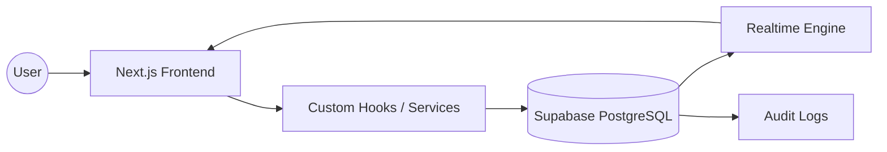
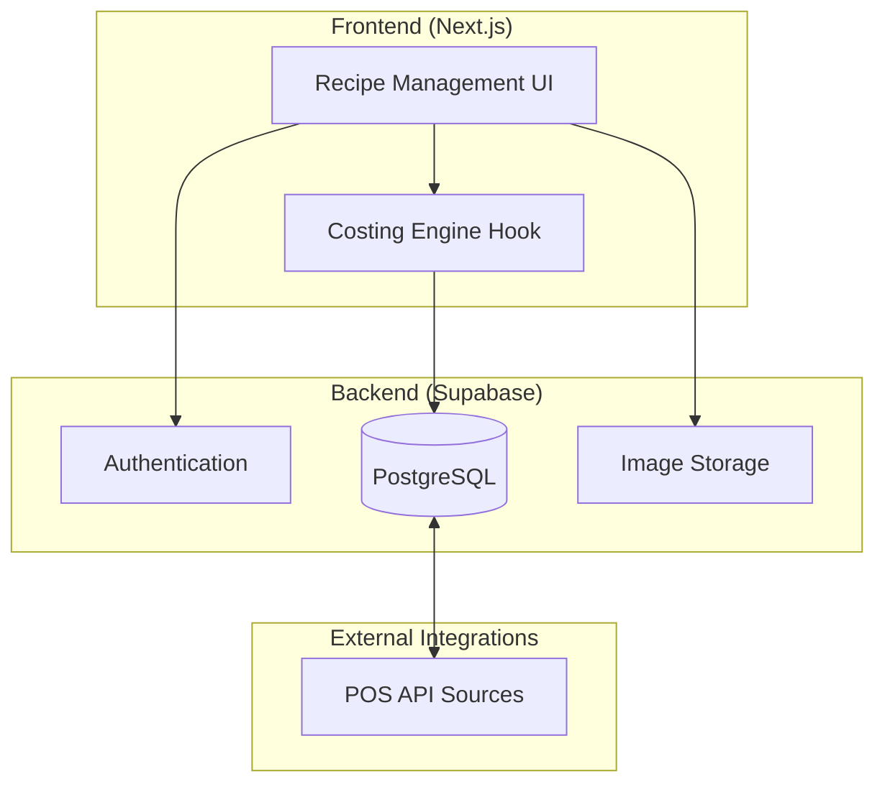

# Portfolio Case Studies: Enterprise Resource Planning & Operations

> [!NOTE]
> Project details and data have been anonymized to respect confidentiality agreements.

---

## Case Study: Real-time Inventory & Waste Management System (Confidential Project)

### Overview
This project involved developing a mission-critical system for tracking inventory and operational waste across multiple high-volume locations. The goal was to eliminate manual reconciliation errors and provide real-time visibility into stock levels and financial leakage.

### The Challenge
- **Data Fragmentation:** Inventory data was siloed across different branches, leading to inaccurate procurement decisions.
- **Waste Visibility:** Operational waste (mermas) was tracked on paper, making it impossible to identify patterns or hold teams accountable.
- **Concurrency Issues:** Multiple users updating stock levels simultaneously often led to race conditions and data corruption.

### Technical Decisions & Implementation
- **Real-time Synchronization:** Leveraged **Supabase Realtime** to ensure that stock updates are propagated instantly across all connected clients, preventing over-ordering or stockouts.
- **Robust Audit Trail:** Implemented a comprehensive auditing system that records every change to inventory levels, including the user, timestamp, and reason (e.g., sale, waste, restock).
- **Custom State Management:** Developed specialized React hooks (e.g., `useInventorySync`) to manage complex optimistic updates and error recovery during network instability.

### Data Flow

---

## Case Study: Scalable Recipe & Costing Engine (Confidential Project)

### Overview
A sophisticated engine designed to calculate the precise cost of complex products composed of multiple sub-components (sub-recipes) and raw ingredients, adjusting dynamically to market price fluctuations.

### The Challenge
- **Recursive Complexity:** Products often consist of sub-recipes, which in turn consist of other sub-recipes, requiring a recursive calculation approach.
- **Unit Conversion:** Ingredients are purchased in bulk (e.g., kilograms) but used in precise measurements (e.g., grams, teaspoons), necessitating a robust conversion utility.
- **Performance:** Calculating costs for thousands of products in real-time could be computationally expensive.

### Technical Decisions & Implementation
- **Recursive Costing Algorithm:** Implemented a depth-first search (DFS) algorithm to traverse recipe hierarchies and aggregate costs from the bottom up.
- **Memoization Strategy:** Used `useMemo` and server-side caching to store calculated costs for sub-components, significantly reducing redundant computations.
- **Centralized Unit Utility:** Created a strictly typed unit conversion library to handle diverse measurement systems (Metric, Imperial, Culinary) with high precision.

### Architecture Diagram

