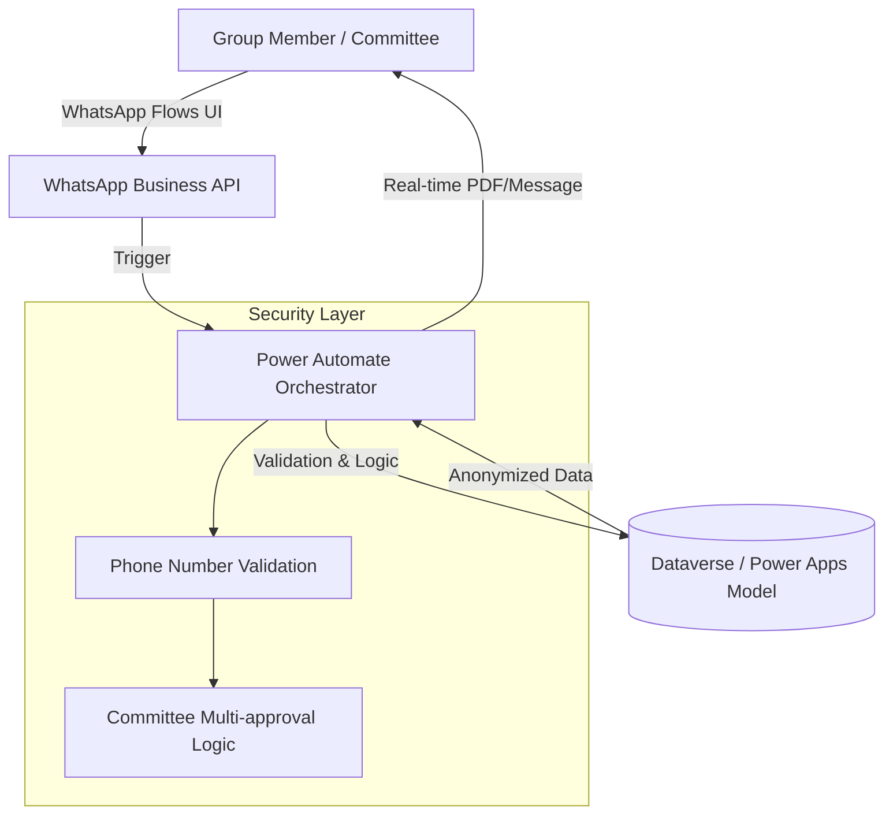

# Portfolio: Confidential Technical Case Studies

> **Confidentiality Notice:** The projects described below are protected by NDAs. Details, client identities, and specific financial data have been anonymized or abstracted while maintaining technical accuracy to demonstrate architectural and problem-solving capabilities.

---

## Case Study: Community-Based Financial Governance & Digital Ledger
**Tech Stack:** WhatsApp Business API, WhatsApp Flows, Power Automate, Power Apps (Dataverse).

### Project Overview
Development of a 100% WhatsApp-native financial ecosystem designed for informal community savings groups. The solution digitizes accounting, share purchasing, and credit management through a "trust-based" digital ledger.

* **Core Function:** Automates the lifecycle of financial groups, from rule definition and committee elections (President, Secretary, Treasurer) to credit refinancing and real-time reporting.
* **The Challenge:** Eliminating the friction of external apps by leveraging a platform users already trust, while maintaining high security and data integrity.

### Architecture Diagram
The following diagram illustrates the flow from user interaction to the automated governance layer:

### Technical Decisions & Implementation
- **Seamless Data Capture:** Utilized WhatsApp Flows to build intuitive form-like experiences directly in the chat, reducing data entry errors for shares and credits.
- **Automated Governance:** Implemented a multi-signature approval flow via Power Automate. A meeting cannot officially open without confirmation messages from the designated committee members.
- **Real-time Accounting:** Developed a query engine that allows any member to generate real-time personal or group balance statements on demand, pulling data instantly from the relational model in Power Apps.
- **Financial Flexibility:** Built logic to handle credit cycles, share accumulation, and refinancing, all while operating as a purely informative accounting layer (no direct fund handling).

### Cybersecurity & Privacy
- **Data Anonymization:** Implementation of protocols to ensure that sensitive accounting records are stored without exposing direct identifiers.
- **Phone-Identity Mapping:** Strict validation of phone numbers as the primary key for authentication within the WhatsApp ecosystem.
- **Access Control:** Hierarchical access based on roles (Committee vs. Member) to manage group rules and financial modifications.
