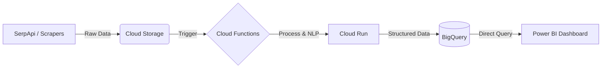

# [ GURU_ANALYTICS_ONLINE ]

> **MISSION:** EXTRACT, ANALYZE, AND VISUALIZE CUSTOMER SENTIMENT FROM UNSTRUCTURED RESTAURANT REVIEWS.

---

## // CLOUD_INFRASTRUCTURE //

This project leverages a full **Google Cloud Platform (GCP)** serverless architecture to ensure scalability and zero-maintenance operations.

### [ GCP_SERVICES ]
*   **Cloud Storage**: Data lake for raw JSON reviews and processed datasets.
*   **Cloud Run**: Containerized Python scrapers and NLP microservices.
*   **Cloud Functions**: Event-driven triggers for data processing pipelines.
*   **BigQuery**: Serverless data warehouse for high-speed SQL analytics.

---

## // DATA_ENGINEERING_PIPELINE //

### 1. INGESTION [ WEB_SCRAPING ]
*   Integrated **SerpApi** to fetch real-time reviews from Google Maps and Yelp.
*   Custom Python scrapers running on **Cloud Run** to handle pagination and rate limiting.

### 2. PROCESSING [ NLP_CORE ]
*   **Sentiment Analysis**: Applied DistilBERT models to classify reviews (Positive, Neutral, Negative).
*   **Aspect-Based Sentiment Analysis (ABSA)**: Extracted specific feedback on "Food", "Service", and "Ambiance".

### 3. VISUALIZATION [ COMMAND_CENTER ]
*   **Power BI Dashboard**: Connected directly to BigQuery.
*   **KPIs**: Net Promoter Score (NPS), Sentiment Trend over Time, Keyword Clouds.
*   **Impact**: Enabled restaurant managers to identify service bottlenecks in real-time.

---

## // KEY_METRICS //
*   **Data Volume**: Processed 50,000+ reviews.
*   **Latency**: < 2 minutes from review posting to dashboard update.
*   **Cost**: Optimized serverless usage for < $5/month.
